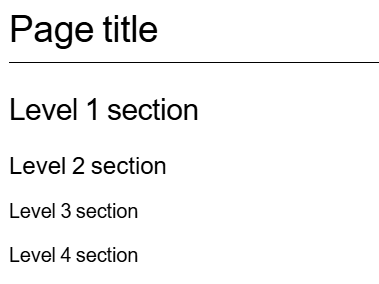

= AsciiDoc语法指南
:experimental:
:icons: font
:imagesdir: ../media

[.lead]
AsciiDoc是一种轻型标记语言，广泛运用于各大公司企业技术文档写作。AsciiDoc类似于Markdown，只需要文本编辑器即可读取或写入，因此入门门槛较低。使用 AsciiDoc 格式书写时，文本内容存储在带有 .adoc 扩展名的纯文本文件中。

就轻量笔记记录而言，Markdown通常会是最优选择。相较于Markdown，AsciiDoc的学习成本更高，但‌支持出版级排版‌（自动编号/交叉引用/印刷控制）、‌企业级扩展性‌（自定义宏/主题/YAML配置）和‌标准化输出‌（多格式统一转换），值得在技术书籍、API文档等专业场景投入学习。

本文档将着重介绍常用AsciiDoc语法，帮助读者快速上手实践。

== 使用工具

推荐安装使用 *Visual Studio Code* 编辑器，并安装VSC插件—— *AsciiDoc*。  + 
尽管亦有像 *Asciidoctor* 这类专门处理.adoc文件的编辑器，VSC (Visual Studio Code) 和对应插件的安装操作都十分方便，并且支持分屏实时预览.adoc文件和通过Git集成实现版本控制，对于新手而言会是更好的选择。

.步骤
. 根据电脑系统下载安装对应的Visual Studio Code版本：
+
https://code.visualstudio.com/Download
. 下载完成后，打开 *Visual Studio Code*。
. 点击左侧导航栏的 *Extensions* (插件)，或者使用快捷键Ctrl+Shift+X，弹出搜索栏后输入 _AsciiDoc_，选择并点击 *Install* (安装)。

== 参考资料

=== NetApp文档
NetApp是一家智能数据基础设施企业，旗下产品文档编写采用的是AsciiDoc标记语言。NetApp的文档官网亦简要介绍了部分AsciiDoc语法。欲了解更多详情，请参阅：

https://docs.netapp.com/zh-cn/contribute/asciidoc_syntax.html#the-basics

NOTE: NetApp文档的简体中文经由机器翻译，仅供参考。如与英语版出现任何冲突，请与以英语版为准。

=== Asciidoctor

Asciidoctor 是一个开源的文本处理器，用于将 AsciiDoc 解析为文档模型并将其转换为输出格式，如 HTML 5、DocBook 5、手册页、PDF、EPUB 3 和其他格式。Asciidoctor的使用文档中详细介绍了Asciidoc语法，欲了解更多详情，请参阅：

https://docs.asciidoctor.org/asciidoc/latest/

== 基础语法

=== 标题

|===
|*语法* | *预览效果*
a|
----
= Page title
== Level 1 section
=== Level 2 section
==== Level 3 section
===== Level 4 section
----
a|

|===

上方展示的是标题语法和对应预览效果，其中 `= Page title` 即为页面标题，含2个 `=` 及以上的标题即子标题。一个.adoc文件只能有一个页面标题，但可以有多个子标题，且同一层级的子标题可以同时存在多个。标题中 `=` 的数量代表的是层级，`=` 的数量越多，该标题层级则越次级。

=== 粗体

|===
|*语法* | *预览效果*
a|
----
This is a *bold-text* example.
----
a|
This is a *bold-text* example.
|===

上方展示的是粗体语法和对应预览效果。`*` 所包裹的加粗内容前后需要加空格。

=== 斜体

|===
|*语法* | *预览效果*
a|
----
This is an _italic-text_ example.
----
a|
This is an _italic-text_ example.
|===

上方展示的是斜体语法和对应预览效果。`_` 所包裹的斜体内容前后需要加空格。

=== 无序列表

|===
|*语法* | *预览效果*
a|
----
* Level 1 list item
** Level 2 list item
*** Level 3 list item
+
Continuation text for the previous list item.
** Level 2 list item
* Level 1 list item
----
a|
* Level 1 list item
** Level 2 list item
*** Level 3 list item
+
Continuation text for the previous list item.
** Level 2 list item
* Level 1 list item
|===

上方展示的是无序列表语法和对应预览效果。`*` 的数量代表的是列表项层级，数量越多，该列表项层级则越次级。`+` 能够使下方文本与该列表项保持保持同一层级，省略会影响该行的格式。

=== 有序列表

|===
|*语法* | *预览效果*
a|
----
.Steps

. Step 1

. Step 2
+
Info for step 2

. Step 3
.. Step 3a
.. Step 3b

. Step 4
----
a|
.Steps

. Step 1

. Step 2
+
Info for step 2

. Step 3
.. Step 3a
.. Step 3b

. Step 4
|===

上方展示的是有序列表语法和对应预览效果。`.` 的数量代表的是列表项层级，数量越多，该列表项层级则越次级。`+` 能够使下方文本与该列表项保持保持同一层级，省略会影响该行的格式。

NOTE: 注意 `.Steps` 和 `. Step 1` 的预览区别。`.` 后直接跟随文本呈现的是斜体小标题，`.` 后空格再跟随文本呈现的是有序列表项。

=== 注释/提示/警告

|===
|*语法* | *预览效果*
a|
----
NOTE: text

TIP: text

CAUTION: text
----
a|
NOTE: text

TIP: text

CAUTION: text
|===

上方展示的是注释/提示/警告语法和对应预览效果。

NOTE: 注释：其中包括读者可能需要了解的额外信息。

TIP: 提示：提示可提供有用的信息，帮助用户执行某项操作或了解某项操作。

CAUTION: 警告：警告会建议读者小心操作。在极少数情况下使用此功能。